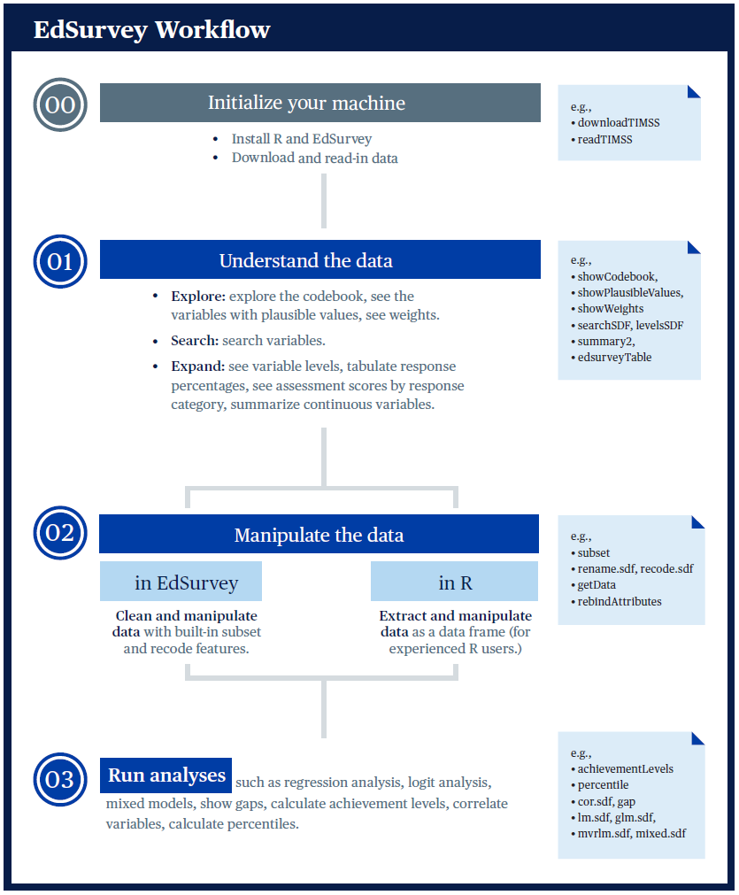

# Summary

Data from large-scale educational assessment programs, such as the National Assessment of Educational Progress (NAEP) and Progress in International Reading Literacy Study (PIRLS), require special methods to conduct statistical analyses because of their scope and complexity. The `EdSurvey` package gives users functions to perform analyses that account for both the complex sample survey design and the use of plausible values. The `EdSurvey` package also seamlessly takes advantage of the `LaF` [@LaF] package to read in data only when required for an analysis. Users with computers that have insufficient memory to read in entire datasets can still do analyses without having to write special code to read in just the appropriate variables. This is all addressed directly in the `EdSurvey` package — behind the scenes and without any special tuning by the user.

# Statement of need

There is a significant demand for accessible and user-friendly software to process and analyze large-scale educational assessment data. These assessments provide valuable insights for policy-makers, education practitioners, and researchers to understand and explore various education-related issues throughout childhood to adulthood, in schools, homes, and neighborhoods.

To access these data with ease, perform data analysis, and test their hypotheses, various free tools have been supplied by assessment institutes, or government agencies, including the International Database IDB Analyzer, NCES Electronic Code Books, NAEP Data Explorer, International Data Explorer, WesVar, and the AM software. 
Most of these free tools are menu-driven software that do not create a shareable code. They were created with the average statistical user in mind and are limited in the types of the statistical analyses that they can support. There are also commercially available software packages (e.g., SPSS, SAS, or STATA) for data merging, cleaning, and manipulation but many analysts use them for data manipulation only and then choose to import the data into tools such as WesVar or AM to account for complex sample designs and use the plausible values.

The `EdSurvey` package was conceived and developed to group in one place all the methodologies and techniques that a researcher needs to access, process, manipulate, and analyze these educational databases. `EdSurvey` can handle most complex samples, plausible value estimations, and longitudinal data methodologies. `EdSurvey` runs in R, a programming language licensed under the GNU General Public License, and is widely used by academia and the research communities. The package is tailored to the processing and analysis of large-scale assessment data with appropriate procedures. It is built as a one-stop shop for downloading, processing, manipulation and analysis of survey data. Other packages in R will analyze large-scale assessment data, including survey [@Lumley], lavaan.survey [@Oberski], svyPVpack [@svyPVpack], BIFIE [@BIFIE], intsvy [@intsvy] and RALSA [@RALSA]. Among these packages, some have limited data coverage (e.g., tailored to international large-scale assessments only), and some require user input about the survey design and plausible values before they can be used. `EdSurvey` was developed to analyze all the large-scale assessments that the United States participates in under NCES, and it incorporates a complex sampling design and plausible value methodology seamlessly. The advantages of `EdSurvey` include:

- allowing for data manipulation inside and outside the package;
- minimizing memory footprint by only reading in required data;
- enabling users to search the names and labels of variables, view frequencies and percentages of response categories of variables, and visualize the data;
- performing complex sample analysis operations;
- computing analyses with plausible values;
- performing multilevel analyses and modeling; 
- expanding functions and data supports to meet the needs of analysts with varying levels of expertise; and
- incorporating sampling weights and performing recommended standard error estimations via replicate weighting or the Taylor Series method.

# Workflow
Recognizing that researchers using R statistical software come with varying levels of experience, the `EdSurvey` package has provided multiple workflows to aid in this process of conducting survey analysis. The following graphic details the recommended workflows with corresponding `EdSurvey` functions.

{ width=70% }

The workflow has three components:

1.	Understanding the data
2.	Preparing the data for analysis
3.	Running the analysis

Note that when preparing data for analysis, the `EdSurvey` package provides functions for users to manipulate their data. Experienced R programmers might prefer to extract and manipulate their data using other R methods or supplementary packages. Each method is supported.

# Conclusion
The `EdSurvey` package provides accessible and user-friendly functions to analyze large-scale educational assessment data, accounting for the complex sample survey design and the use of plausible values. For detailed function walkthroughs and the education studies supported by `EdSurvey`, consult the `EdSurvey` User's Guide [@Lee].

# Acknowledgements

This project has been funded at least in part with Federal funds from the U.S. Department of Education under contract numbers ED-IES-12-D-0002/0004 and 91990022C0053. The content of this publication does not necessarily reflect the views or policies of the U.S. Department of Education nor does mention of trade names, commercial products, or organizations imply endorsement by the U.S. Government.

# References